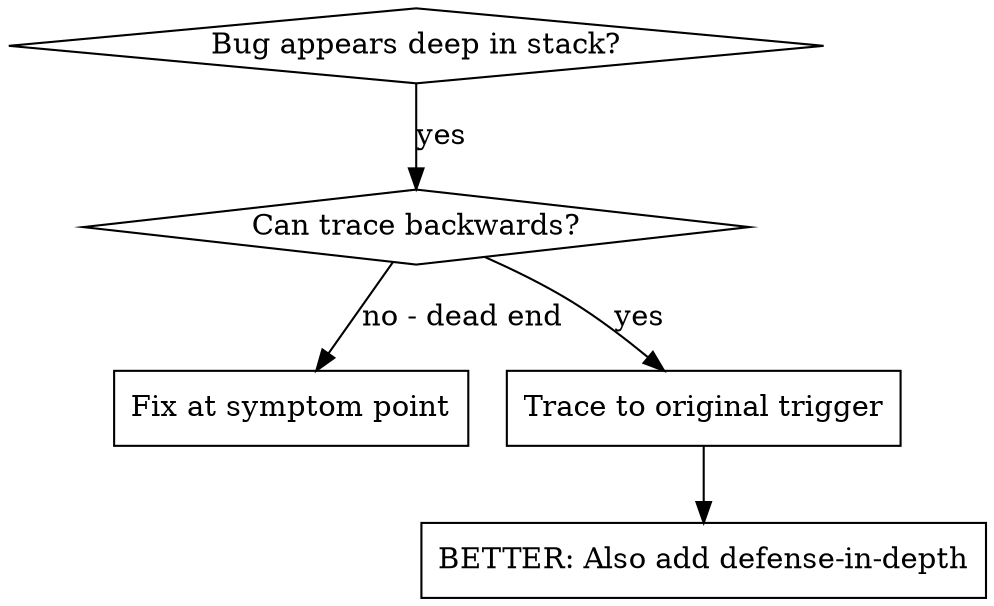
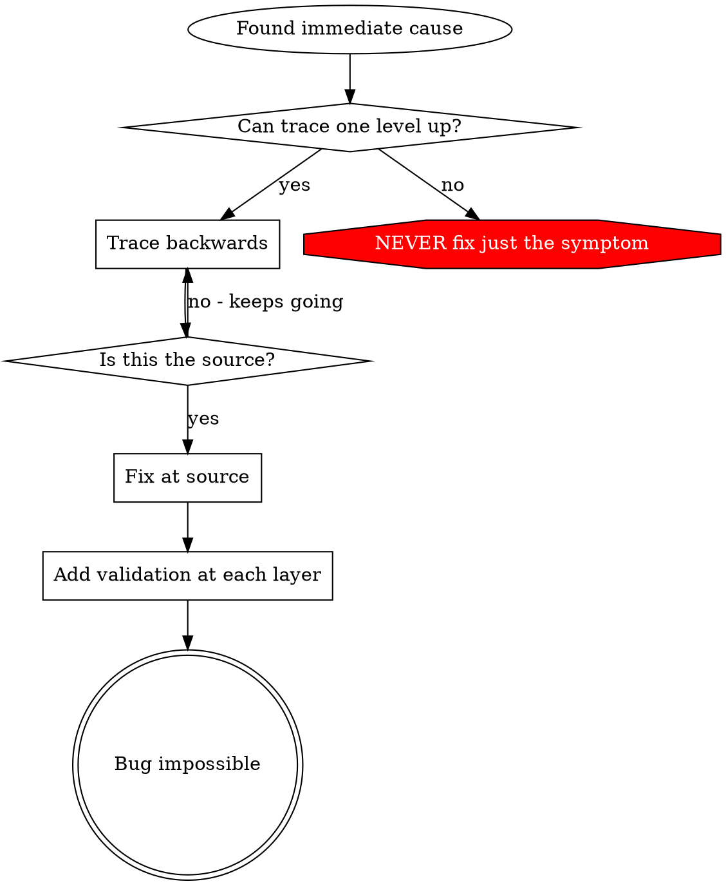

<!--
Vendored from Superpowers (https://github.com/obra/superpowers)
Source: skills/systematic-debugging/root-cause-tracing.md @ release v5.1.0
(commit f2cbfbefebbfef77321e4c9abc9e949826bea9d7)
Copyright (c) 2025 Jesse Vincent (Prime Radiant) - MIT License
Adapted for Kimen: upstream's find-polluter.sh helper replaced with an inline
test-bisection procedure (Kimen runs Vitest via Nx, not bare npm test).
See /NOTICE for full third-party attribution.
-->

# Root Cause Tracing

## Overview

Bugs often manifest deep in the call stack (git init in wrong directory, file
created in wrong location, database opened with wrong path). Your instinct is
to fix where the error appears, but that's treating a symptom.

**Core principle:** Trace backward through the call chain until you find the
original trigger, then fix at the source.

## When to Use



**Use when:**
- Error happens deep in execution (not at entry point)
- Stack trace shows long call chain
- Unclear where invalid data originated
- Need to find which test/code triggers the problem

## The Tracing Process

### 1. Observe the Symptom
```
Error: git init failed in ~/project/packages/core
```

### 2. Find Immediate Cause
**What code directly causes this?**
```typescript
await execFileAsync('git', ['init'], { cwd: projectDir });
```

### 3. Ask: What Called This?
```typescript
WorktreeManager.createSessionWorktree(projectDir, sessionId)
  → called by Session.initializeWorkspace()
  → called by Session.create()
  → called by test at Project.create()
```

### 4. Keep Tracing Up
**What value was passed?**
- `projectDir = ''` (empty string!)
- Empty string as `cwd` resolves to `process.cwd()`
- That's the source code directory!

### 5. Find Original Trigger
**Where did the empty string come from?**
```typescript
const context = setupCoreTest(); // Returns { tempDir: '' }
Project.create('name', context.tempDir); // Accessed before beforeEach!
```

## Adding Stack Traces

When you can't trace manually, add instrumentation:

```typescript
// Before the problematic operation
async function gitInit(directory: string) {
  const stack = new Error().stack;
  console.error('DEBUG git init:', {
    directory,
    cwd: process.cwd(),
    nodeEnv: process.env.NODE_ENV,
    stack,
  });

  await execFileAsync('git', ['init'], { cwd: directory });
}
```

**Critical:** Use `console.error()` in tests (not a logger — it may be
suppressed)

**Run and capture:**
```bash
pnpm exec nx run-many -t test 2>&1 | grep 'DEBUG git init'
```

**Analyze stack traces:**
- Look for test file names
- Find the line number triggering the call
- Identify the pattern (same test? same parameter?)

## Finding Which Test Causes Pollution (Bisection)

If something appears during tests but you don't know which test creates it,
bisect deterministically instead of staring:

1. Confirm the polluting artifact (a stray file, leaked global, dangling
   listener) and a cheap check for it (e.g. `test -e packages/core/.git`).
2. Run test files one at a time (`pnpm exec vitest run <file>`), checking for
   the artifact after each run; or split the file list in halves and recurse —
   O(log n) runs instead of O(n).
3. The first run that produces the artifact identifies the polluter. Then
   trace WITHIN that file the same way: run describe blocks/tests selectively
   (`vitest run -t <name>`).
4. Fix at the source AND make the pollution impossible (see
   `defense-in-depth.md`); a polluting test is a bug even when it passes
   (Art. III: full isolation, parallel-safe).

## Real Example: Empty projectDir

**Symptom:** `.git` created in `packages/core/` (source code)

**Trace chain:**
1. `git init` runs in `process.cwd()` ← empty cwd parameter
2. WorktreeManager called with empty projectDir
3. Session.create() passed empty string
4. Test accessed `context.tempDir` before beforeEach
5. setupCoreTest() returns `{ tempDir: '' }` initially

**Root cause:** Top-level variable initialization accessing empty value

**Fix:** Made tempDir a getter that throws if accessed before beforeEach

**Also added defense-in-depth:**
- Layer 1: Project.create() validates directory
- Layer 2: WorkspaceManager validates not empty
- Layer 3: NODE_ENV guard refuses git init outside tmpdir
- Layer 4: Stack trace logging before git init

## Key Principle



**NEVER fix just where the error appears.** Trace back to find the original
trigger.

## Stack Trace Tips

**In tests:** Use `console.error()` not a logger — the logger may be suppressed
**Before operation:** Log before the dangerous operation, not after it fails
**Include context:** Directory, cwd, environment variables, timestamps
**Capture stack:** `new Error().stack` shows the complete call chain

## Real-World Impact

From an upstream debugging session (2025-10-03):
- Found root cause through a 5-level trace
- Fixed at source (getter validation)
- Added 4 layers of defense
- 1847 tests passed, zero pollution
